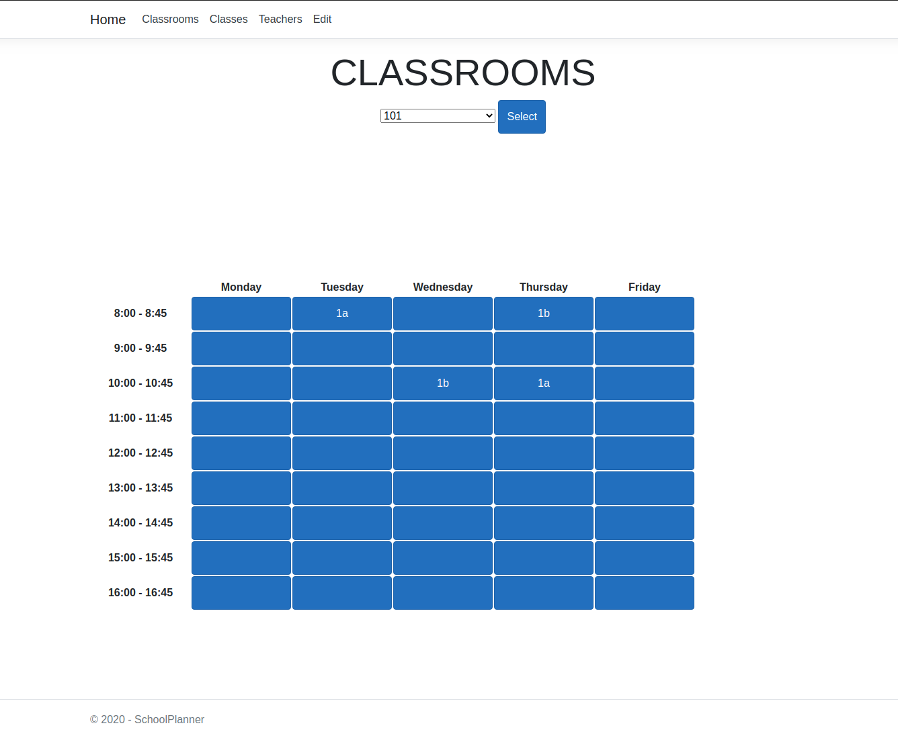
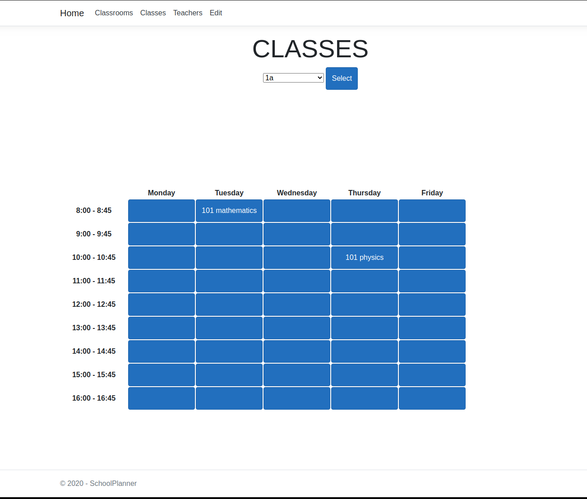
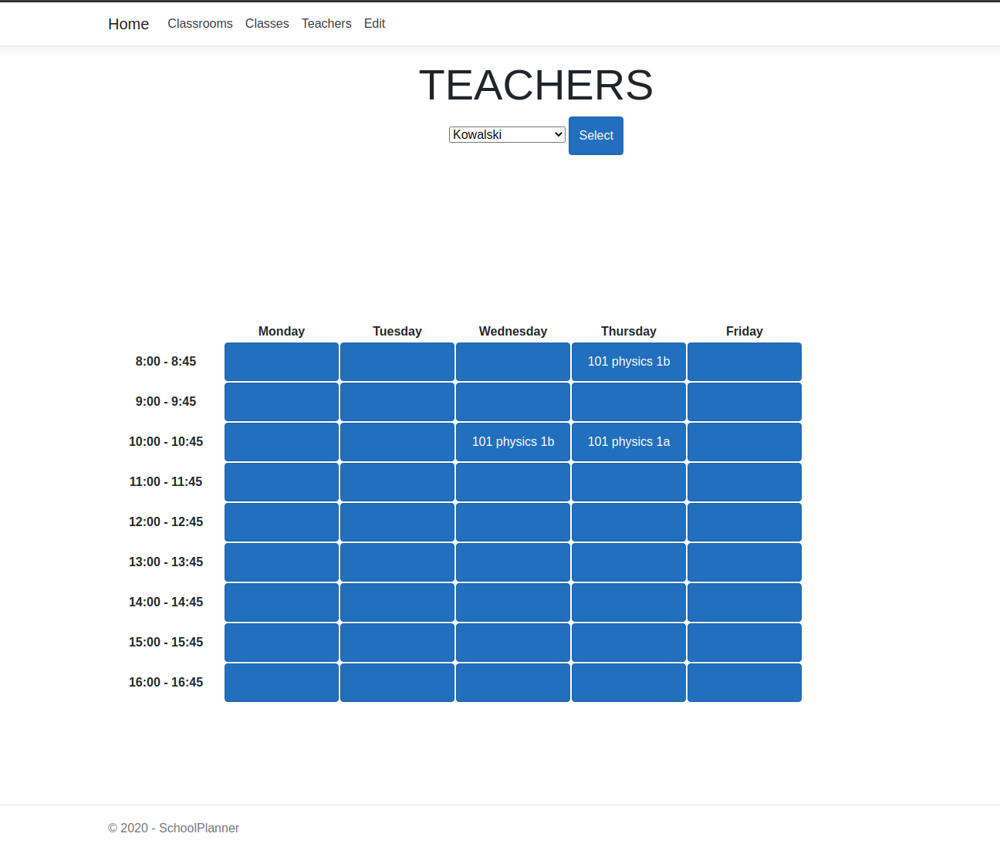
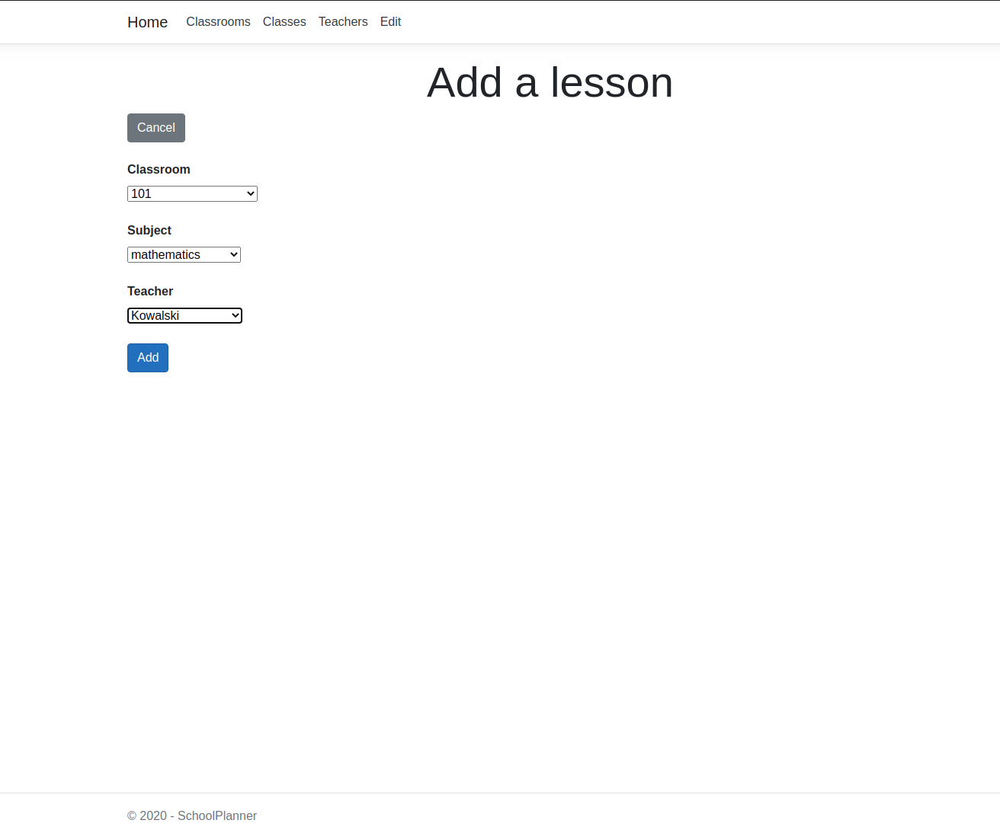
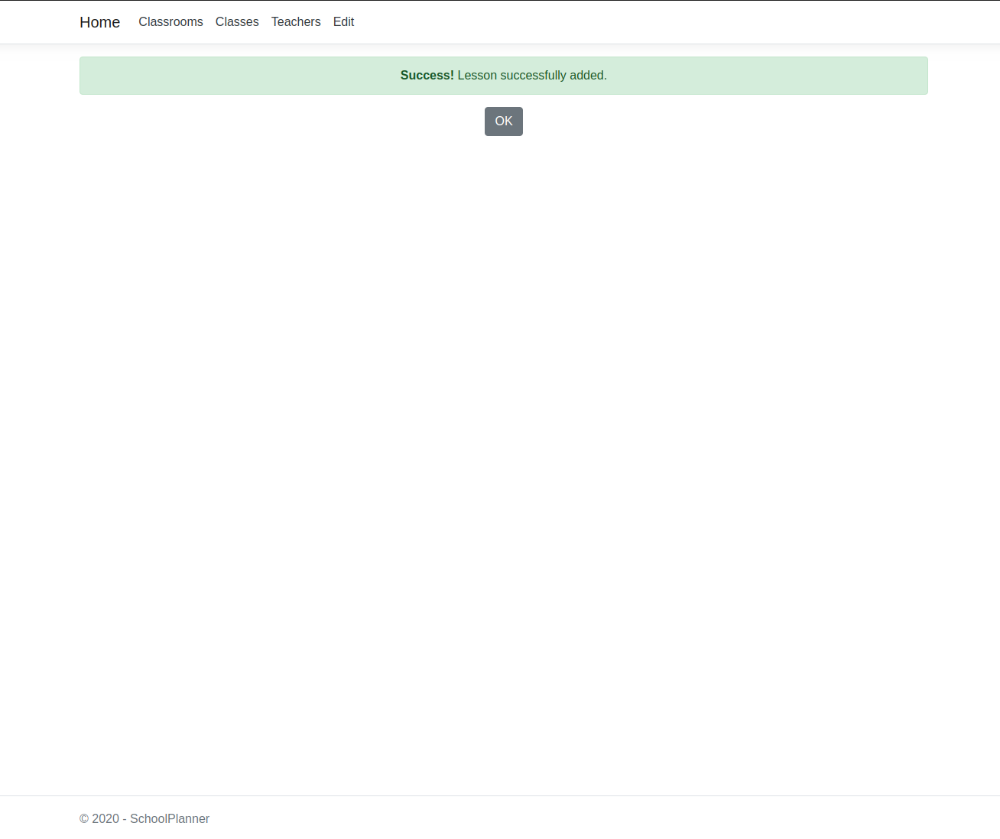
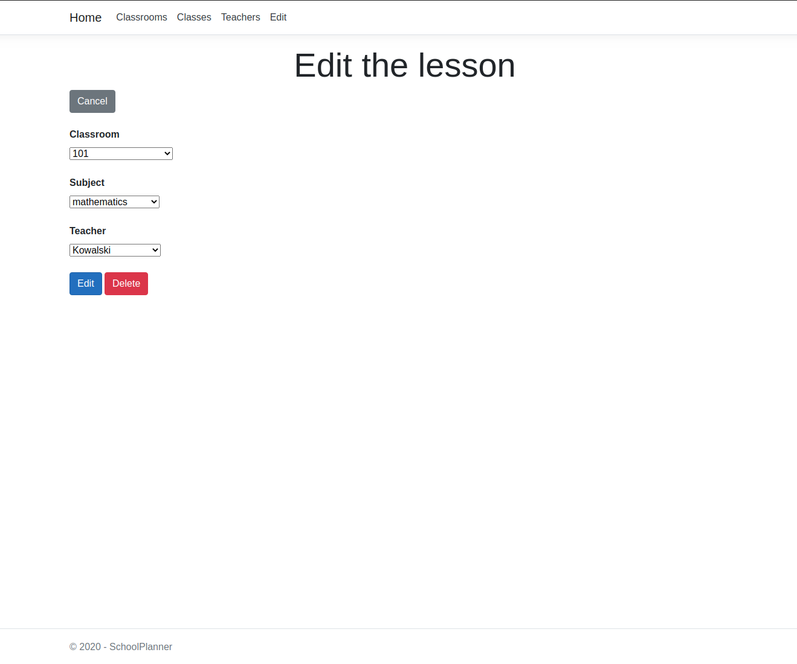
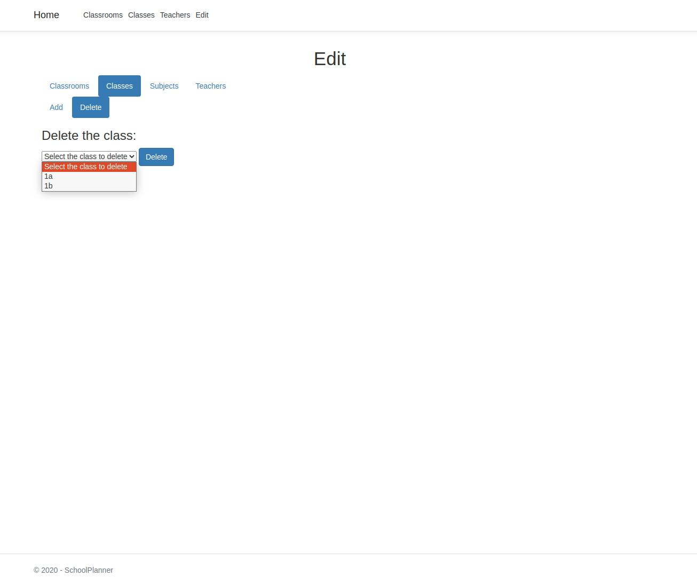
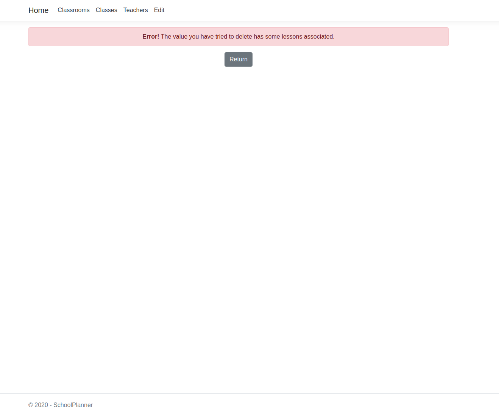
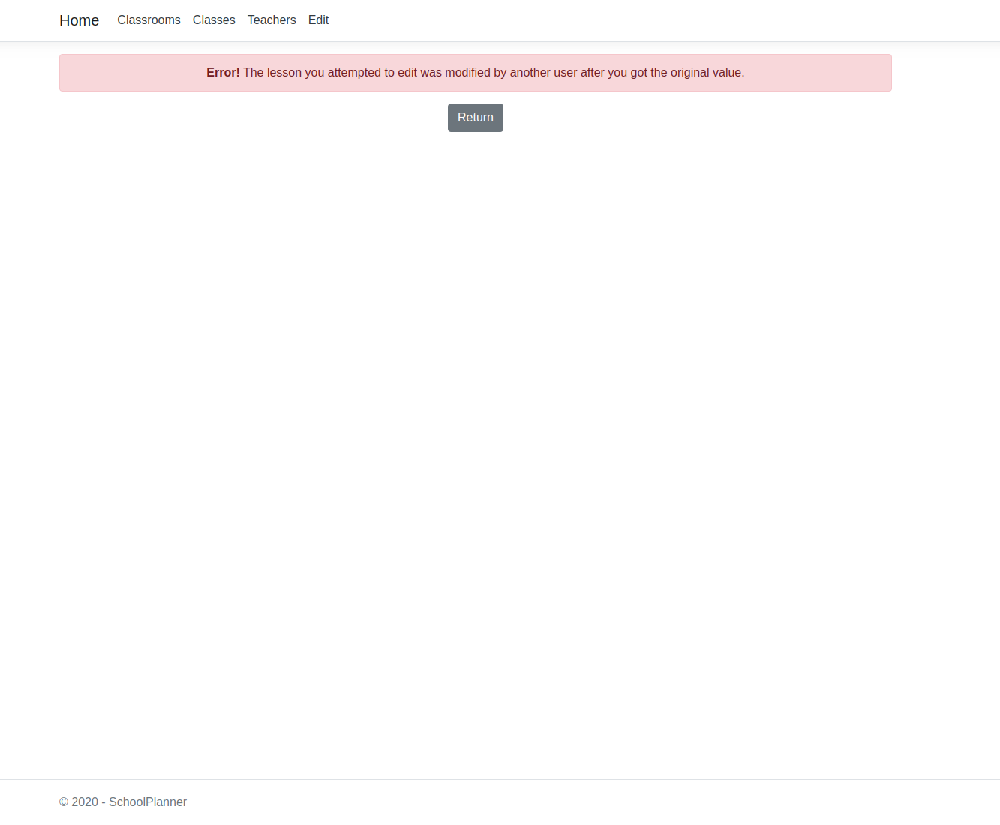

# SchoolPlanner
ASP.MVC .Net Core web application for planning school timetables

## Table of contents
* [About](#about)
* [Screenshots](#screenshots)
* [Technologies](#technologies)
* [Features](#features)
* [To-do](#to-do)

## About
Project made for the subject RAD Tools at the Warsaw University of Technology. 

## Screenshots

## Technologies
* C#
* ASP.MVC
* .Net Core
* Bootstrap
* MySQL
* Entity Framework
* Razor
* CSS
* HTML

## Features

* The user can select a classroom or teacher or class for which the data is presented.
* The user can click an entry (filled or empty) to add/edit/delete a lesson .
* The application only presents data that can be saved (e.g. when a class already has classes, it is not on the list).
* The application allows the user to save only non-conflicting data (e.g. the same class in different rooms at the same time).
* The application allows to modify classrooms, subjects, classes and teachers.
* It is not possible to delete e.g. a teacher who already has classes associated.
* Writing to the database includes overwriting verification - you cannot overwrite information that the user has not seen.

## To-do:
* Sharing views between screens
